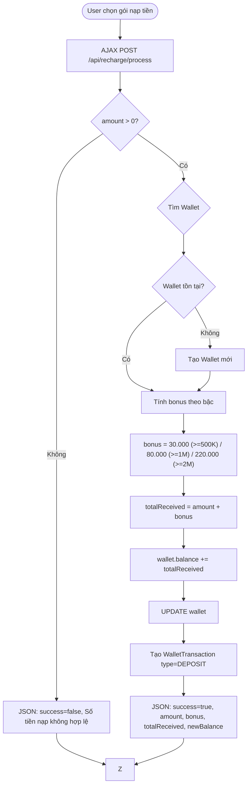

# GameForge Store - Báo Cáo Phân Tích Kiến Trúc Chi Tiết

> **Mã nguồn:** Dự án web bán hàng game kỹ thuật số (CD-Keys / License Keys)  
> **Ngày phân tích:** 29/05/2026  
> **Người thực hiện:** AI Architecture Analyst  
> **Người hướng dẫn:** người dùng

---

## Lời Nói Đầu

Đây là báo cáo phân tích toàn diện dành cho người mới học, giải thích **toàn bộ kiến trúc**, **từng dòng code quan trọng**, và **lý thuyết nền tảng** đằng sau mỗi quyết định thiết kế. Tôi sẽ đi từ tổng quan đến chi tiết, từ lý thuyết đến thực hành, đảm bảo bạn hiểu **bản chất** chứ không chỉ là "cái gì".

Dự án này là một cửa hàng game online sử dụng mô hình bán license key (CD-key) kỹ thuật số, tương tự các nền tảng như Steam, GOG, hay Keyshop. Người dùng có thể duyệt game, thêm vào giỏ, mua bằng ví điện tử tích hợp, và nhận license key để kích hoạt game.

---

# PHẦN 1: Tổng Quan Kiến Trúc

## 1.1 Sơ Đồ Tổng Thể

```
┌─────────────────────────────────────────────────────────────────────────────┐
│                            TRÌNH DUYỆT NGƯỜI DÙNG                             │
│  (Browser - Chrome/Firefox)                                                  │
│  ┌─────────────┐  ┌─────────────┐  ┌─────────────┐  ┌──────────────────┐  │
│  │   HTML/CSS   │  │  JavaScript  │  │  Bootstrap 5 │  │  Lucide Icons    │  │
│  │   (JSP)     │  │   (AJAX)    │  │  UI Layout   │  │  SVG Icons       │  │
│  └──────┬──────┘  └──────┬──────┘  └──────┬──────┘  └──────┬───────────┘  │
└─────────┼─────────────────┼─────────────────┼─────────────────┼──────────────┘
          │ HTTP(S)         │ AJAX/Fetch       │ CDN             │ CDN
          │ (Form Submit)   │ (XHR)            │                 │
          ▼                 ▼                  ▼                  ▼
┌─────────────────────────────────────────────────────────────────────────────┐
│                        APACHE TOMCAT SERVER                                  │
│                    (Servlet Container - WAR Deployment)                       │
│  ┌──────────────────────────────────────────────────────────────────────┐   │
│  │                     SPRING MVC FRAMEWORK (5.3.20)                      │   │
│  │                                                                       │   │
│  │  ┌─────────────────┐     ┌──────────────────┐     ┌───────────────┐  │   │
│  │  │  Controllers    │────▶│   Services      │────▶│  DAOs /      │  │   │
│  │  │  (8 files)      │     │  (EmailService) │     │  Hibernate   │  │   │
│  │  │                 │     │                 │     │  Session     │  │   │
│  │  └─────────────────┘     └──────────────────┘     └───────┬───────┘  │   │
│  │           │                   │                           │          │   │
│  │           │                   ▼                           │          │   │
│  │  ┌─────────────────────────────────────────────────┐     │          │   │
│  │  │           HIBERNATE ORM (5.6.9)                │◀────┘          │   │
│  │  │  ┌──────────┐  ┌──────────┐  ┌──────────────┐  │                │   │
│  │  │  │Entity    │  │HQL/Crit- │  │Transactions  │  │                │   │
│  │  │  │Mapping   │  │eria API  │  │Management    │  │                │   │
│  │  │  │(JPA)     │  │          │  │(ACID)        │  │                │   │
│  │  │  └──────────┘  └──────────┘  └──────────────┘  │                │   │
│  │  └────────────────────────┬────────────────────────┘                │   │
│  └───────────────────────────┼──────────────────────────────────────────┘   │
└──────────────────────────────┼──────────────────────────────────────────────┘
                               │ JDBC
                               ▼
┌─────────────────────────────────────────────────────────────────────────────┐
│                    MICROSOFT SQL SERVER                                      │
│  ┌──────────┐  ┌────────┐  ┌──────────┐  ┌──────────┐  ┌─────────────────┐  │
│  │  users   │  │ games  │  │  orders  │  │ wallets  │  │ license_keys    │  │
│  │          │  │        │  │          │  │          │  │                 │  │
│  │ +orders  │  │+media  │  │+items    │  │+txns     │  │ +library_items  │  │
│  │ +wallets │  │+cats   │  │          │  │          │  │                 │  │
│  │ +carts   │  │        │  │          │  │          │  │                 │  │
│  │ +library │  │        │  │          │  │          │  │                 │  │
│  └──────────┘  └────────┘  └──────────┘  └──────────┘  └─────────────────┘  │
└─────────────────────────────────────────────────────────────────────────────┘

                    NGOÀI HỆ THỐNG (External Services)
                    ┌─────────────────────┐
                    │  JavaMail SMTP      │  (Gửi email xác nhận đơn hàng)
                    │  (Mock mode: Log)   │
                    ├─────────────────────┤
                    │  Vietnam Address API │  (GitHub JSON - Tỉnh/Huyện/Xã)
                    │  (GitHub CDN)       │
                    ├─────────────────────┤
                    │  QR Server API      │  (api.qrserver.com - Tạo mã QR)
                    └─────────────────────┘
```

## 1.2 Mô Hình Kiến Trúc 3-Tier

Dự án tuân theo mô hình **3-Tier (Three-Tier Architecture)** phổ biến nhất trong các ứng dụng web doanh nghiệp:

```
┌────────────────────────────────────────────────────────────────────┐
│  TIER 1: PRESENTATION LAYER (Giao diện người dùng)               │
│  ┌────────────────┐ ┌────────────────┐ ┌────────────────────────┐ │
│  │   JSP Views    │ │   CSS Assets   │ │   JavaScript (AJAX)   │ │
│  │   (8 pages)   │ │   (7 files)    │ │   (7 modules)         │ │
│  └────────────────┘ └────────────────┘ └────────────────────────┘ │
│  Công nghệ: JSP + JSTL + Bootstrap 5 + Vanilla JavaScript         │
└─────────────────────────────┬──────────────────────────────────────┘
                              │ HTTP Requests / Model Attributes
                              ▼
┌────────────────────────────────────────────────────────────────────┐
│  TIER 2: BUSINESS LOGIC LAYER (Xử lý nghiệp vụ)                  │
│  ┌────────────────┐ ┌────────────────┐ ┌────────────────────────┐ │
│  │  Controllers   │ │  Services      │ │  PasswordEncoderUtil   │ │
│  │  (8 files)     │ │  (EmailService)│ │  (BCrypt hashing)     │ │
│  │                │ │                │ │                        │ │
│  │ +Form handling │ │ +Email HTML    │ │ +encode()             │ │
│  │ +AJAX APIs     │ │ +Mock/Real    │ │ +matches()            │ │
│  │ +Validation    │ │   sending     │ │                        │ │
│  │ +Session mgmt  │ │               │ │                        │ │
│  └────────────────┘ └────────────────┘ └────────────────────────┘ │
│  Công nghệ: Spring MVC 5.3.20 + Spring TX (Transaction Mgmt)     │
└─────────────────────────────┬──────────────────────────────────────┘
                              │ DAO Interface / Hibernate Session
                              ▼
┌────────────────────────────────────────────────────────────────────┐
│  TIER 3: DATA ACCESS LAYER (Truy xuất dữ liệu)                   │
│  ┌────────────────┐ ┌────────────────┐ ┌────────────────────────┐ │
│  │  BaseDAO       │ │  UserDAO       │ │  CartItemDAO           │ │
│  │  (Generic CRUD)│ │  (User queries)│ │  (Cart queries)        │ │
│  └────────────────┘ └────────────────┘ └────────────────────────┘ │
│  ┌──────────────────────────────────────────────────────────────┐ │
│  │              HIBERNATE ORM + SQL SERVER                       │ │
│  │  +Entity Mapping (JPA Annotations)                          │ │
│  │  +HQL Queries                                               │ │
│  │  +Native SQL Queries (hybrid)                                │ │
│  └──────────────────────────────────────────────────────────────┘ │
└─────────────────────────────┬──────────────────────────────────────┘
                              │ JDBC Driver (mssql-jdbc 9.4.1)
                              ▼
                    ┌─────────────────────┐
                    │   SQL SERVER DB     │
                    │   (14 tables)       │
                    └─────────────────────┘
```

**Tại sao 3-Tier?** Mỗi tầng có **trách nhiệm rõ ràng**:
- **Presentation** chỉ lo hiển thị, không chứa logic nghiệp vụ.
- **Business Logic** chứa toàn bộ xử lý nghiệp vụ (thanh toán, license key, ví điện tử).
- **Data Access** chỉ lo truy xuất database, hoàn toàn không biết gì về HTTP hay giao diện.

Ưu điểm: **Dễ bảo trì**, **dễ kiểm thử** (test từng tầng riêng biệt), **tái sử dụng code**. Nếu mai này muốn đổi giao diện web sang mobile app, chỉ cần thay tầng Presentation, hai tầng còn lại giữ nguyên.

## 1.3 Công Nghệ Sử Dụng và Lý Do Lựa Chọn

| Tầng | Công nghệ | Version | Lý do chọn | Nhược điểm |
|------|-----------|---------|------------|-------------|
| **Build** | Maven | - | Quản lý dependency chuẩn, cấu hình đơn giản, tích hợp IDE tốt | XML verbose |
| **Backend** | Spring MVC | 5.3.20 | IoC/DI mạnh, Transaction Management tự động, tích hợp Hibernate tốt | Config verbose (XML-based trong project này) |
| **ORM** | Hibernate | 5.6.9 | Ánh xạ object-relational chuẩn JPA, HQL linh hoạt, caching | Phức tạp, N+1 query problem |
| **Database** | SQL Server | 2012 | Phổ biến ở Việt Nam, hỗ trợ Windows tốt, stored procedure | Chi phí license cao, ít phổ biến quốc tế |
| **JDBC** | mssql-jdbc | 9.4.1 | Driver chính thức của Microsoft cho SQL Server | Driver v9 hỗ trợ Java 8 |
| **Template** | JSP + JSTL | 1.2 | Server-side rendering nhanh, hỗ trợ JSTL tag library | Không phải reactive, full-page reload |
| **Frontend** | Bootstrap | 5.3.3 | Grid system mạnh, responsive ngay, component library phong phú | Nhiều site dùng chung, look "generic" nếu không customize |
| **Security** | Spring Security Crypto | 5.7.3 | BCrypt hashing mạnh, không cần full Spring Security | Thiếu CSRF, Session management mặc định |
| **Email** | JavaMail | 1.6.2 | Chuẩn Java enterprise cho email SMTP | Cấu hình phức tạp, dễ timeout |
| **JSON** | Jackson | 2.13.5 | Serialize/deserialize JSON nhanh, tích hợp Spring | Config phức tạp với date handling |
| **Server** | Apache Tomcat | - | Servlet container phổ biến nhất, hỗ trợ WAR deploy | Không mạnh bằng Jetty cho long-polling |
| **Java** | Java | 1.8 | Ổn định, tương thích rộng, Lambda expression | Đã có phiên bản mới hơn (11, 17, 21) |

## 1.4 Cấu Trúc Thư Mục Chi Tiết

```
D:\Eclipse\GameStore\
│
├── pom.xml                                    # Maven: khai báo dependency,
│                                            # build config, plugin
│
├── GUIDE/                                    # Thư mục tài liệu
│   └── CHECKOUT-500-FIX-29-05-2026.md       # Ghi chép bug fix
│
└── src/
    └── main/
        ├── java/com/gamestore/              # Mã nguồn Java chính
        │   ├── config/
        │   │   └── GlobalExceptionHandler.java  # Bắt exception toàn cục,
        │   │                                   # trả JSON cho API, log lỗi
        │   ├── controller/                    # Tầng Controller (7 controllers)
        │   │   ├── AuthController.java        # Đăng nhập / Đăng ký / Đăng xuất
        │   │   ├── GameController.java        # Trang chủ, list game, tạo key
        │   │   ├── CheckoutController.java    # Thanh toán, đơn hàng, success
        │   │   ├── CartApiController.java     # CRUD giỏ hàng (AJAX)
        │   │   ├── DashboardController.java   # Bảng điều khiển user
        │   │   ├── LibraryController.java    # Thư viện game + lịch sử giao dịch
        │   │   ├── RechargeController.java    # Nạp tiền ví điện tử
        │   │   ├── ProfileApiController.java # Cập nhật hồ sơ (AJAX)
        │   │   └── PromoApiController.java   # Tra cứu promo codes (AJAX)
        │   ├── dao/                          # Tầng Data Access Object
        │   │   ├── BaseDAO.java              # Generic CRUD (save, findById, findAll)
        │   │   ├── UserDAO.java              # findByEmail, findByUsername, existsByUsername
        │   │   └── CartItemDAO.java          # findByUserAndGame
        │   ├── entity/                       # 14 Entity classes (JPA/Hibernate)
        │   │   ├── User.java                 # Tài khoản người dùng
        │   │   ├── Game.java                 # Sản phẩm game
        │   │   ├── Category.java             # Thể loại game (n-n với Game)
        │   │   ├── GameMedia.java            # Hình ảnh/video game
        │   │   ├── CartItem.java             # Item trong giỏ hàng
        │   │   ├── Order.java                # Đơn hàng
        │   │   ├── OrderItem.java            # Dòng sản phẩm trong đơn
        │   │   ├── Wallet.java               # Ví điện tử của user (1-1 với User)
        │   │   ├── WalletTransaction.java    # Giao dịch ví (nạp tiền, mua hàng)
        │   │   ├── LicenseKey.java           # CD-key / License key
        │   │   ├── LibraryItem.java          # Game trong thư viện của user
        │   │   └── PromoCode.java            # Mã khuyến mãi / Coupon
        │   ├── service/
        │   │   └── EmailService.java        # Gửi email xác nhận đơn hàng
        │   └── util/
        │       └── PasswordEncoderUtil.java  # BCrypt encode/verify
        │
        ├── resources/
        │   └── database.properties            # Cấu hình DB + Email (dev credentials)
        │
        └── webapp/
            ├── WEB-INF/
            │   ├── web.xml                   # Servlet filter encoding UTF-8
            │   ├── spring-servlet.xml         # Spring config: Hibernate, ViewResolver
            │   └── views/                    # 8 JSP pages (Server-side rendering)
            │       ├── index.jsp              # Trang chủ + hero section + game grid
            │       ├── login.jsp              # Đăng nhập / Đăng ký (2 form trong 1 page)
            │       ├── checkout.jsp            # Trang thanh toán + form địa chỉ VN
            │       ├── order-success.jsp       # Trang xác nhận thành công + license keys
            │       ├── dashboard.jsp           # Bảng điều khiển user
            │       ├── library.jsp             # Thư viện game đã mua
            │       ├── recharge.jsp            # Nạp tiền ví điện tử
            │       └── transactions.jsp        # Lịch sử giao dịch (order + nạp tiền)
            │
            └── assets/
                ├── css/                       # 7 file CSS (Neo-Brutalism style)
                │   ├── index.css              # Global styles + component styles
                │   ├── login.css              # Login page specific
                │   ├── checkout.css            # Checkout page specific
                │   ├── dashboard.css           # Dashboard specific
                │   ├── library.css             # Library page specific
                │   ├── recharge.css            # Recharge page specific
                │   └── transactions.css        # Transaction history specific
                └── js/                        # 7 file JavaScript
                    ├── index.js               # Homepage: cart, favorites, carousel, search
                    ├── login.js               # Auth: form toggle, password validation ISO
                    ├── checkout.js            # Checkout: payment tabs, address API, QR flow
                    ├── dashboard.js           # Dashboard interactions
                    ├── library.js             # Library page interactions
                    ├── recharge.js            # Recharge AJAX + bonus calculation
                    └── transactions.js        # Transaction history display
```

---

# PHẦN 2: Thiết Kế Cơ Sở Dữ Liệu

## 2.1 Tổng Quan Các Bảng

Dự án có **14 bảng** trong SQL Server, được ánh xạ qua JPA/Hibernate annotations:

```
users                  ───┬───  wallets (1:1)
                         ├───  cart_items (1:N)
                         ├───  orders (1:N)
                         └───  library_items (1:N)

games                  ───┬───  game_media (1:N)
                         ├───  game_categories (N:N)
                         ├───  cart_items (1:N)
                         ├───  order_items (1:N)
                         ├───  library_items (1:N)
                         ├───  license_keys (1:N)
                         └─────  promo_codes (1:N, optional)

orders                 ───┬───  order_items (1:N)

wallets                ───┬───  wallet_transactions (1:N)

categories             ───┬───  game_categories (N:N)
```

## 2.2 Chi Tiết Từng Bảng

### Bảng `users` - Tài Khoản Người Dùng

| Thuộc tính | Kiểu | Ràng buộc | Mô tả |
|------------|-------|-----------|--------|
| `id` | BIGINT | PRIMARY KEY, IDENTITY | ID tự tăng |
| `email` | NVARCHAR(255) | NULL | Email (không unique vì có thể null) |
| `username` | VARCHAR(100) | **UNIQUE**, NOT NULL | Tên đăng nhập |
| `password` | NVARCHAR(255) | NOT NULL | Mật khẩu đã BCrypt hash |
| `fullName` | NVARCHAR(255) | NULL | Họ tên đầy đủ |
| `avatar` | NVARCHAR(500) | NULL | URL avatar |
| `status` | VARCHAR(50) | NOT NULL, DEFAULT 'ACTIVE' | Trạng thái: ACTIVE / INACTIVE |
| `createdAt` | DATETIME | NULL | Thời gian tạo tài khoản |

```6:38:src/main/java/com/gamestore/entity/User.java
@Entity
@Table(name = "users")
public class User {
    @Id
    @GeneratedValue(strategy = GenerationType.IDENTITY)
    private Long id;

    @Column(columnDefinition = "NVARCHAR(255)")
    private String email;

    @Column(unique = true, nullable = false, length = 100)
    private String username;

    @Column(nullable = false, columnDefinition = "NVARCHAR(255)")
    private String password;

    @Column(columnDefinition = "NVARCHAR(500)")
    private String avatar;

    @Column(nullable = false, length = 50)
    private String status;

    private LocalDateTime createdAt;

    @PrePersist
    public void prePersist() {
        if (createdAt == null) createdAt = LocalDateTime.now();
        if (status == null) status = "ACTIVE";  // Default khi INSERT
    }
```

**Giải thích `@PrePersist`**: Đây là **lifecycle callback** của JPA. Trước khi Hibernate `INSERT` bản ghi mới vào DB, nó sẽ tự động gọi method `prePersist()`. Nếu `createdAt` chưa được set, nó sẽ tự gán thời gian hiện tại. Tương tự, nếu `status` null thì mặc định là "ACTIVE". Điều này đảm bảo dữ liệu luôn có giá trị hợp lệ ngay từ lúc tạo mà không cần code bên ngoài phải set.

**Lưu ý về `email` không UNIQUE**: Trong thiết kế này, `email` có thể null nhưng không unique. Điều này có nghĩa một user có thể không có email, và nhiều user có thể chia sẻ email (nếu null). Trên thực tế, đây là **design decision** có thể gây vấn đề — tốt nhất nên đặt `email` là `UNIQUE` và `NOT NULL`.

### Bảng `games` - Sản Phẩm Game

| Thuộc tính | Kiểu | Ràng buộc | Mô tả |
|------------|-------|-----------|--------|
| `id` | BIGINT | PK, IDENTITY | ID tự tăng |
| `title` | VARCHAR | NULL | Tên game |
| `slug` | VARCHAR | NULL | URL-friendly name (VD: cyberpunk-2077) |
| `description` | NVARCHAR(MAX) | NULL | Mô tả chi tiết |
| `price` | DECIMAL(19,2) | NULL | Giá bán |
| `original_price` | DECIMAL(19,2) | NULL | Giá gốc (để so sánh giảm giá) |
| `status` | VARCHAR | NULL | ACTIVE / INACTIVE |

```9:39:src/main/java/com/gamestore/entity/Game.java
@Entity
@Table(name = "games")
public class Game {
    // Ảnh/video của game - EAGER vì cần load nhanh trên homepage
    @OneToMany(mappedBy = "game", cascade = CascadeType.ALL, fetch = FetchType.EAGER)
    private List<GameMedia> mediaList;

    // Quan hệ n-n với Category - EAGER vì game list cần show categories
    @ManyToMany(fetch = FetchType.EAGER)
    @JoinTable(
        name = "game_categories",
        joinColumns = @JoinColumn(name = "game_id"),
        inverseJoinColumns = @JoinColumn(name = "category_id")
    )
    private Set<Category> categories = new HashSet<>();
```

**Giải thích `FetchType.EAGER`**: Đây là **cách Hibernate load dữ liệu liên quan**. `EAGER` có nghĩa là ngay khi load 1 `Game`, Hibernate sẽ **tự động JOIN** và load luôn cả `mediaList` và `categories`. Ngược lại là `LAZY` — chỉ load khi truy cập.

**Tại sao dùng EAGER ở đây?**: Vì trang chủ (`index.jsp`) hiển thị danh sách game kèm hình ảnh và categories. Nếu dùng LAZY, mỗi lần gọi `game.getMediaList()` trong JSP sẽ trigger thêm 1 query (N+1 problem). Dùng EAGER giảm N+1 nhưng tăng memory.

**Nhược điểm tiềm tàng**: Với danh sách hàng trăm game, EAGER load tất cả media + categories cùng lúc có thể gây **performance problem**. Giải pháp tốt hơn là dùng `JOIN FETCH` trong HQL query (đã thấy trong `GameController` dòng 29-31).

### Bảng `categories` - Thể Loại Game

| Thuộc tính | Kiểu | Ràng buộc | Mô tả |
|------------|-------|-----------|--------|
| `id` | BIGINT | PK, IDENTITY | ID tự tăng |
| `name` | VARCHAR | NOT NULL | Tên thể loại (Action, RPG...) |
| `slug` | VARCHAR | NULL | URL-friendly name |
| `description` | VARCHAR | NULL | Mô tả |

### Bảng `game_categories` - Bảng Trung Gian (Many-to-Many)

Bảng này **KHÔNG có Entity class** vì Hibernate quản lý tự động qua `@ManyToMany`:

```33:38:src/main/java/com/gamestore/entity/Game.java
@ManyToMany(fetch = FetchType.EAGER)
@JoinTable(
    name = "game_categories",        // Tên bảng trung gian trong DB
    joinColumns = @JoinColumn(name = "game_id"),      // FK từ Game
    inverseJoinColumns = @JoinColumn(name = "category_id")  // FK từ Category
)
private Set<Category> categories = new HashSet<>();
```

Đây là **quan hệ N-N (Many-to-Many)**: Mỗi game có nhiều thể loại, và mỗi thể loại có nhiều game.

### Bảng `game_media` - Hình Ảnh / Video Game

| Thuộc tính | Kiểu | Ràng buộc | Mô tả |
|------------|-------|-----------|--------|
| `id` | BIGINT | PK, IDENTITY | ID tự tăng |
| `game_id` | BIGINT | FK → games | Game cha |
| `mediaType` | VARCHAR | NULL | Loại: 'IMAGE' hoặc 'VIDEO' |
| `mediaUrl` | VARCHAR | NULL | URL hình ảnh/video |
| `isPrimary` | BOOLEAN | DEFAULT FALSE | Có phải ảnh chính không |

### Bảng `cart_items` - Giỏ Hàng

| Thuộc tính | Kiểu | Ràng buộc | Mô tả |
|------------|-------|-----------|--------|
| `id` | BIGINT | PK, IDENTITY | ID tự tăng |
| `user_id` | BIGINT | FK → users, NOT NULL | Ai đang giữ cart item này |
| `game_id` | BIGINT | FK → games, NOT NULL | Game nào |
| `quantity` | INT | NOT NULL, DEFAULT 1 | Số lượng (luôn = 1) |
| `addedAt` | DATETIME | NOT NULL | Thời điểm thêm vào giỏ |

**Quan hệ**: `users (1) ──→ (N) cart_items (N) ←── (1) games` — mỗi user có nhiều cart items, mỗi cart item thuộc về 1 game.

**Tại sao quantity luôn = 1?** Trong thiết kế này, mỗi game chỉ được thêm vào giỏ 1 lần (check trùng ở `CartApiController.addToCart`). Nếu thêm lại, hệ thống báo "đã có trong giỏ" thay vì tăng số lượng. Đây là business rule phù hợp cho cửa hàng game — không ai mua 2 license key cùng 1 game trên cùng 1 tài khoản.

### Bảng `wallets` - Ví Điện Tử

| Thuộc tính | Kiểu | Ràng buộc | Mô tả |
|------------|-------|-----------|--------|
| `id` | BIGINT | PK, IDENTITY | ID tự tăng |
| `user_id` | BIGINT | FK → users, **UNIQUE**, NOT NULL | 1 user chỉ có 1 ví |
| `balance` | DECIMAL(15,2) | NOT NULL, DEFAULT 0 | Số dư VND |

```13:19:src/main/java/com/gamestore/entity/Wallet.java
@OneToOne(fetch = FetchType.LAZY)
@JoinColumn(name = "user_id", nullable = false, unique = true)
private User user;
```

**Quan hệ 1-1**: Mỗi user có đúng 1 ví, và mỗi ví thuộc đúng 1 user. Ràng buộc `unique = true` trên `user_id` đảm bảo không thể tạo 2 ví cho cùng 1 user.

**Tại sao tách thành bảng riêng thay vì thêm cột `wallet_balance` vào `users`?**

1. **Chuẩn hóa**: Bảng `wallets` có thể mở rộng độc lập (thêm `pin`, `bank_account`, `card_last_4`...).
2. **Audit trail**: Giao dịch được ghi riêng ở `wallet_transactions`.
3. **Security**: Phân quyền riêng cho ví (ví dụ: chỉ admin mới xem được số dư).

### Bảng `wallet_transactions` - Giao Dịch Ví

| Thuộc tính | Kiểu | Ràng buộc | Mô tả |
|------------|-------|-----------|--------|
| `id` | BIGINT | PK, IDENTITY | ID tự tăng |
| `wallet_id` | BIGINT | FK → wallets, NOT NULL | Ví thực hiện giao dịch |
| `type` | VARCHAR(50) | NOT NULL | Loại: RECHARGE / DEPOSIT / PURCHASE / REFUND |
| `amount` | DECIMAL(15,2) | NOT NULL | Số tiền |
| `status` | VARCHAR(50) | NOT NULL | SUCCESS / FAILED / PENDING |
| `referenceId` | VARCHAR | NULL | ID tham chiếu (ORDER_xxx, RECH_xxx) |
| `createdAt` | DATETIME | NOT NULL | Thời gian giao dịch |

### Bảng `orders` - Đơn Hàng

| Thuộc tính | Kiểu | Ràng buộc | Mô tả |
|------------|-------|-----------|--------|
| `id` | BIGINT | PK, IDENTITY | ID tự tăng |
| `user_id` | BIGINT | FK → users, NOT NULL | Ai đặt hàng |
| `subtotalAmount` | DECIMAL(15,2) | NOT NULL | Tổng phụ (trước giảm giá) |
| `discountAmount` | DECIMAL(15,2) | NOT NULL | Số tiền được giảm |
| `totalAmount` | DECIMAL(15,2) | NOT NULL | Tổng cộng (sau giảm) |
| `promo_code_id` | BIGINT | NULL | Mã KM áp dụng |
| `status` | VARCHAR(50) | NOT NULL, DEFAULT 'PENDING' | PENDING / PAID / CANCELLED / REFUNDED |
| `paymentMethod` | VARCHAR | NULL | WALLET / CARD / BANK |
| `fullName` | VARCHAR | NULL | Tên người nhận |
| `phone` | VARCHAR | NULL | SĐT người nhận |
| `address` | VARCHAR | NULL | Địa chỉ cụ thể (số nhà, đường) |
| `province` | VARCHAR | NULL | Tỉnh/Thành phố |
| `district` | VARCHAR | NULL | Quận/Huyện |
| `ward` | VARCHAR | NULL | Phường/Xã |
| `notes` | VARCHAR | NULL | Ghi chú đơn hàng |
| `createdAt` | DATETIME | NOT NULL | Thời điểm đặt |
| `paidAt` | DATETIME | NULL | Thời điểm thanh toán thành công |

**8 trường giao hàng** (`fullName` → `notes`) lưu thông tin người nhận — đây là design decision cho mô hình bán key kỹ thuật số. Dù license key giao qua email, hệ thống vẫn thu thập địa chỉ (theo quy định thương mại điện tử Việt Nam).

### Bảng `order_items` - Dòng Sản Phẩm Trong Đơn

| Thuộc tính | Kiểu | Ràng buộc | Mô tả |
|------------|-------|-----------|--------|
| `id` | BIGINT | PK, IDENTITY | ID tự tăng |
| `order_id` | BIGINT | FK → orders, NOT NULL | Đơn hàng cha |
| `game_id` | BIGINT | FK → games, NOT NULL | Game được mua |
| `unitPrice` | DECIMAL(15,2) | NOT NULL | Giá tại thời điểm mua |
| `discountAmount` | DECIMAL(15,2) | NOT NULL | Tiền giảm giá cho dòng này |
| `paidAmount` | DECIMAL(15,2) | NOT NULL | Số tiền thực trả |
| `quantity` | INT | NOT NULL, DEFAULT 1 | Số lượng |
| `status` | VARCHAR(50) | NOT NULL, DEFAULT 'PAID' | Trạng thái dòng |

**Tại sao cần bảng `order_items` riêng?** Vì 1 đơn hàng có thể mua nhiều game. Mỗi game có:
- Giá khác nhau tại thời điểm mua
- Mức giảm giá khác nhau (nếu có promo riêng)
- Trạng thái có thể khác nhau (1 game có thể refund, game kia không)

### Bảng `license_keys` - License Key / CD-Key

| Thuộc tính | Kiểu | Ràng buộc | Mô tả |
|------------|-------|-----------|--------|
| `id` | BIGINT | PK, IDENTITY | ID tự tăng |
| `game_id` | BIGINT | FK → games, NOT NULL | Game mà key này dùng kích hoạt |
| `keyString` | VARCHAR | NOT NULL | Chuỗi key (VD: ABC12-DEF34-GHI56) |
| `order_item_id` | BIGINT | NULL | Đơn hàng đã bán key này |
| `owner_id` | BIGINT | FK → users, NULL | User sở hữu key |
| `status` | VARCHAR(50) | NOT NULL, DEFAULT 'AVAILABLE' | AVAILABLE / SOLD / REVOKED |
| `createdAt` | DATETIME | NOT NULL | Ngày tạo key |
| `assignedAt` | DATETIME | NULL | Thời điểm gán cho user |

**Chuỗi key format**: `ABCDE-FGHIJ-KLMNO` — 15 ký tự chia thành 3 nhóm 5, được tạo bằng `UUID.randomUUID()` trong `GameController.generateKeys()`.

### Bảng `library_items` - Thư Viện Game Của User

| Thuộc tính | Kiểu | Ràng buộc | Mô tả |
|------------|-------|-----------|--------|
| `id` | BIGINT | PK, IDENTITY | ID tự tăng |
| `user_id` | BIGINT | FK → users, NOT NULL | Ai sở hữu |
| `game_id` | BIGINT | FK → games, NOT NULL | Game gì |
| `license_key_id` | BIGINT | FK → license_keys, **UNIQUE** | Key dùng kích hoạt |
| `status` | VARCHAR(50) | NOT NULL, DEFAULT 'ACTIVE' | ACTIVE / REVOKED |
| `acquiredAt` | DATETIME | NOT NULL | Thời điểm nhận được |

**Ràng buộc `UNIQUE` trên `license_key_id`**: 1 license key chỉ được gán cho tối đa 1 library item — đảm bảo key không bị dùng chung.

**Tại sao không lưu trực tiếp key vào `library_items`?** Vì license key tồn tại độc lập, có thể bị revoke, transfer, hoặc thay thế. Tách riêng giúp quản lý vòng đời key dễ dàng hơn.

### Bảng `promo_codes` - Mã Khuyến Mãi

| Thuộc tính | Kiểu | Ràng buộc | Mô tả |
|------------|-------|-----------|--------|
| `id` | BIGINT | PK, IDENTITY | ID tự tăng |
| `publisher_id` | BIGINT | NULL | Ai tạo mã (admin) |
| `game_id` | BIGINT | NULL | Mã chỉ áp dụng cho game này (null = mọi game) |
| `code` | VARCHAR(100) | **UNIQUE**, NOT NULL | Mã KM (VD: SUMMER2026) |
| `discountPercentage` | DECIMAL(5,2) | NOT NULL | % giảm giá |
| `expiryDate` | DATETIME | NULL | Ngày hết hạn |
| `usageLimit` | INT | NULL | Số lần sử dụng tối đa |
| `currentUsage` | INT | NOT NULL, DEFAULT 0 | Đã sử dụng bao nhiêu lần |
| `status` | VARCHAR(50) | NOT NULL, DEFAULT 'ACTIVE' | ACTIVE / EXPIRED / DISABLED |

## 2.3 Sơ Đồ Quan Hệ (ERD)

```
┌──────────────┐       ┌──────────────┐       ┌──────────────────┐
│   CATEGORIES │       │    GAMES     │       │   GAME_MEDIA     │
│──────────────│       │──────────────│       │──────────────────│
│ PK id        │       │ PK id        │1────N│ PK id            │
│    name      │N──────│    title     │       │ FK game_id       │
│    slug      │       │    slug      │       │    mediaType     │
│    desc      │       │    price     │       │    mediaUrl      │
└──────────────┘       │    status    │       │    isPrimary     │
         │             └──────┬───────┘       └──────────────────┘
         │                    │
         │         ┌──────────┴──────────┐
         │         │                     │
         ▼         ▼                     ▼
┌──────────────────┐  ┌──────────────────┐  ┌──────────────────┐
│ GAME_CATEGORIES  │  │  CART_ITEMS      │  │   ORDERS         │
│ (Join Table N-N) │  │──────────────────│  │──────────────────│
│ FK game_id       │  │ PK id            │  │ PK id            │
│ FK category_id   │  │ FK user_id  ─────┼──│ FK user_id       │
└──────────────────┘  │ FK game_id  ─────┼──│    subtotalAmt   │
                       │    quantity      │  │    discountAmt   │
┌──────────────┐       │    addedAt      │  │    totalAmt      │
│    USERS     │       └──────────────────┘  │    status        │
│──────────────│                              │    paymentMethod │
│ PK id        │                              │    fullName      │
│    email     │       ┌──────────────────┐   │    province      │
│    username  │       │  ORDER_ITEMS     │   │    ... (8 ship) │
│    password  │       │──────────────────│   │    createdAt    │
│    fullName  │       │ PK id            │   └───────┬────────┘
│    avatar    │       │ FK order_id ─────┼──────────┤
│    status    │       │ FK game_id  ─────┼──────────┤
│    createdAt │       │    unitPrice     │          │
└───────┬──────┘       │    paidAmount    │          │
        │              └──────────────────┘          │
        │                                           │
  ┌─────┴──────────┐              ┌─────────────────┘
  │                │              │
  ▼                ▼              ▼
┌────────────┐  ┌────────────┐  ┌──────────────────┐
│  WALLETS   │  │CART_ITEMS  │  │ LICENSE_KEYS     │
│────────────│  │ (FK user)  │  │──────────────────│
│ PK id      │  │            │  │ PK id            │
│ FK user_id │  └────────────┘  │ FK game_id       │
│    balance │                  │    keyString      │
└─────┬──────┘                  │    owner_id       │
      │                         │    status         │
      │                         └─────────┬────────┘
      ▼                                   │
┌──────────────────┐                       │
│WALLET_TRANSACTIONS│                     ▼
│──────────────────│              ┌──────────────────┐
│ PK id            │              │ LIBRARY_ITEMS    │
│ FK wallet_id     │              │──────────────────│
│    type          │              │ PK id            │
│    amount        │              │ FK user_id       │
│    status        │              │ FK game_id       │
│    referenceId   │              │ FK license_key_id│ (UNIQUE)
└──────────────────┘              │    status        │
                                  │    acquiredAt    │
                                  └──────────────────┘

┌──────────────────┐
│  PROMO_CODES     │
│──────────────────│
│ PK id            │
│    code (UNIQUE) │
│    game_id       │
│    discountPct   │
│    expiryDate    │
│    usageLimit    │
│    currentUsage  │
│    status        │
└──────────────────┘
```

## 2.4 Các Index Được Tạo

Dự án **KHÔNG tự tạo index thủ công** (không có file SQL schema). Tuy nhiên, Hibernate tự động tạo index trên các cột có:

1. **Primary Key** (`id`) → Clustered index tự động trên mọi bảng
2. **Foreign Key** → Non-clustered index để tăng tốc JOIN:
   - `cart_items.user_id`, `cart_items.game_id`
   - `orders.user_id`
   - `order_items.order_id`, `order_items.game_id`
   - `wallets.user_id`
   - `wallet_transactions.wallet_id`
   - `library_items.user_id`, `library_items.game_id`, `library_items.license_key_id`
   - `license_keys.game_id`, `license_keys.owner_id`
   - `game_categories.game_id`, `game_categories.category_id`
3. **Ràng buộc UNIQUE** → Unique index:
   - `users.username` (UNIQUE constraint)
   - `library_items.license_key_id` (UNIQUE constraint)
   - `wallets.user_id` (UNIQUE constraint)
   - `promo_codes.code` (UNIQUE constraint)

**Các index nên thêm thủ công** (cải thiện hiệu năng):

```sql
-- Tìm kiếm user theo email (trong UserDAO.findByEmail)
CREATE INDEX idx_users_email ON users(email);

-- Tìm license key AVAILABLE nhanh (trong CheckoutController)
CREATE INDEX idx_license_keys_game_status ON license_keys(game_id, status);

-- Lọc game ACTIVE nhanh (trong GameController)
CREATE INDEX idx_games_status ON games(status);

-- Lọc cart theo user nhanh
CREATE INDEX idx_cart_items_user ON cart_items(user_id);

-- Giao dịch ví theo thời gian
CREATE INDEX idx_wallet_tx_created ON wallet_transactions(createdAt DESC);
```

---

# PHẦN 3: Luồng Hoạt Động Chi Tiết

## Luồng 1: Đăng Ký Tài Khoản (Register)

### 3.1.1 Mục đích và điều kiện kích hoạt

**Route**: `POST /register` → `AuthController.processRegister()`

Người dùng điền form đăng ký trên trang `/login` (cùng trang với login, dùng JS toggle hiển thị form Register) và submit. Hệ thống tạo tài khoản, mã hóa mật khẩu bằng BCrypt, và tự động tạo ví điện tử rỗng.

### 3.1.2 Lưu Đồ (Flowchart)

```mermaid
flowchart TD
    A([User submit form Register]) --> B{HTTP POST /register}
    B --> C[Controller nhận parameters]
    C --> D{"confirmPassword == password?"}
    D -- Không --> E[Model error: "Mật khẩu nhập lại không khớp!"]
    E --> F[return "login" - hiển thị lại form]
    D -- Có --> G{findByEmail(email) == null?}
    G -- Không --> H[Model error: "Email đã được sử dụng!"]
    H --> F
    G -- Có --> I{existsByUsername(username) == false?}
    I -- Có --> J[User đăng ký trùng]
    I -- Không --> J
    J -- Không --> K[Model error: "Username đã được sử dụng!"]
    J -- Có --> L[BCrypt.encode(password)]
    K --> F
    L --> M[Tạo User entity mới]
    M --> N[userDAO.save(newUser)]
    N --> O[Tạo Wallet entity, balance = 0]
    O --> P[sessionFactory.getCurrentSession.save(wallet)]
    P --> Q[Model success: "Đăng ký thành công!"]
    Q --> R[return "login"]
```

### 3.1.3 Bóc Tách Chi Tiết Từng Bước

#### Bước 1: Form Submit (Frontend → Backend)

**Frontend** (`login.jsp`): User điền form và submit. Form gửi POST request với các tham số:

```
POST /register
Content-Type: application/x-www-form-urlencoded

username=vinhnguyen&fullName=Nguyen Van Vinh&email=vinh@example.com
&password=Pass1234!&confirmPassword=Pass1234!
```

**Tại sao dùng `application/x-www-form-urlencoded`?** Đây là cách form HTML mặc định gửi dữ liệu, đơn giản, tương thích tốt. Các giá trị được encode thành chuỗi key=value, cách nhau bởi `&`.

#### Bước 2: Controller nhận request

```70:76:src/main/java/com/gamestore/controller/AuthController.java
    @PostMapping("/register")
    public String processRegister(@RequestParam("username") String username,
                                  @RequestParam("fullName") String fullName,
                                  @RequestParam("email") String email,
                                  @RequestParam("password") String password,
                                  @RequestParam("confirmPassword") String confirmPassword,
                                  Model model) {
```

`@RequestParam` là annotation của Spring MVC, dùng để **binding parameter** từ HTTP request vào biến Java. Spring tự động parse body request, tìm param có tên tương ứng, và gán vào biến.

**Tham số `Model model`**: Là một interface trong Spring MVC, dùng để truyền dữ liệu từ Controller **xuống View** (JSP). Khi gọi `model.addAttribute("error", "...")`, dữ liệu được đặt vào request scope để JSP có thể đọc qua `${error}`.

#### Bước 3: Kiểm tra mật khẩu khớp nhau

```78:82:src/main/java/com/gamestore/controller/AuthController.java
        if (!password.equals(confirmPassword)) {
            model.addAttribute("error", "Mật khẩu nhập lại không khớp!");
            return "login";
        }
```

Validation đầu tiên — so sánh `password` và `confirmPassword`. Đây là **client-side validation** (cũng có trong `login.js` dòng 182-207 với real-time feedback) nhưng **server-side validation vẫn bắt buộc** vì client có thể bị bypass.

#### Bước 4: Kiểm tra email trùng lặp

```84:88:src/main/java/com/gamestore/controller/AuthController.java
        if (userDAO.findByEmail(email) != null) {
            model.addAttribute("error", "Email này đã được sử dụng!");
            return "login";
        }
```

Gọi `UserDAO.findByEmail()`. Xem code:

```16:25:src/main/java/com/gamestore/dao/UserDAO.java
    public User findByEmail(String email) {
        try {
            return sessionFactory.getCurrentSession()
                .createQuery("FROM User WHERE email = :email AND status = 'ACTIVE'", User.class)
                .setParameter("email", email)
                .uniqueResult();
        } catch (Exception e) {
            return null;
        }
    }
```

**Giải thích HQL**: `FROM User WHERE email = :email AND status = 'ACTIVE'`
- `User` = tên Entity class, KHÔNG phải tên bảng trong DB
- `:email` = named parameter, an toàn trước SQL injection
- `status = 'ACTIVE'` = chỉ tìm tài khoản đang hoạt động
- `uniqueResult()` = trả về đúng 1 kết quả; nếu có nhiều hơn hoặc 0, nó sẽ throw exception → catch return null

**Tại sao dùng try-catch?** `uniqueResult()` ném `NonUniqueResultException` nếu tìm thấy nhiều hơn 1 bản ghi. Vì `email` trong thiết kế không UNIQUE, đây là cách xử lý an toàn.

#### Bước 5: Kiểm tra username trùng lặp

```90:94:src/main/java/com/gamestore/controller/AuthController.java
        if (userDAO.existsByUsername(username.trim())) {
            model.addAttribute("error", "Tên đăng nhập đã được sử dụng!");
            return "login";
        }
```

Dùng `COUNT` query thay vì `findByUsername` — hiệu quả hơn vì không cần load toàn bộ entity:

```40:50:src/main/java/com/gamestore/dao/UserDAO.java
    public boolean existsByUsername(String username) {
        try {
            Long count = sessionFactory.getCurrentSession()
                .createQuery("SELECT COUNT(u) FROM User u WHERE username = :username", Long.class)
                .setParameter("username", username)
                .uniqueResult();
            return count != null && count > 0;
        } catch (Exception e) {
            return false;
        }
    }
```

**Tại sao dùng `COUNT` thay vì `findByUsername`?** Khi chỉ cần kiểm tra "có tồn tại không", query `SELECT COUNT(*)` nhẹ hơn `SELECT *` vì:
1. Database không cần load toàn bộ row vào memory
2. COUNT có thể dùng index mà không cần full table scan
3. Kết quả là 1 số nguyên, không cần map sang object

#### Bước 6: Mã hóa mật khẩu bằng BCrypt

```96:101:src/main/java/com/gamestore/controller/AuthController.java
        User newUser = new User();
        newUser.setUsername(username.trim());
        newUser.setFullName(fullName);
        newUser.setEmail(email);
        newUser.setPassword(PasswordEncoderUtil.encode(password));
```

Gọi `BCryptPasswordEncoder.encode()`. BCrypt là **adaptive hashing function** — nghĩa là:

1. **Salt tự động**: Mỗi lần encode, BCrypt tạo 1 salt ngẫu nhiên 128-bit khác nhau. Cùng password "Pass123!" hai lần encode sẽ cho hai hash khác nhau:
   - `$2a$10$N9qo8uLOickgx2ZMRZoMyeIjZAgcfl7p92ldGxad68LJZdL17lhWy`
   - `$2a$10$rOzJqQZQlxLXYT8r7vLgAOuTk6jKcZ3B9Q0vKj7fVx4mT3nG5R9Wq`

2. **Cost factor**: `BCryptPasswordEncoder()` mặc định dùng cost = 10 (2^10 = 1024 rounds). Mỗi round hash lại output của round trước. Với cost 10, việc hash 1 password mất khoảng 200-300ms trên CPU hiện đại — đủ chậm để ngăn brute force, đủ nhanh để không ảnh hưởng UX.

3. **Chống rainbow table**: Vì salt khác nhau mỗi lần, attacker không thể dùng precomputed hash table (rainbow table) để đối chiếu.

**Code của PasswordEncoderUtil:**

```5:15:src/main/java/com/gamestore/util/PasswordEncoderUtil.java
public class PasswordEncoderUtil {
    private static final BCryptPasswordEncoder encoder = new BCryptPasswordEncoder();

    public static String encode(String rawPassword) {
        return encoder.encode(rawPassword);
    }

    public static boolean matches(String rawPassword, String encodedPassword) {
        return encoder.matches(rawPassword, encodedPassword);
    }
}
```

#### Bước 7: Lưu User và tạo Wallet trong transaction

```104:110:src/main/java/com/gamestore/controller/AuthController.java
        userDAO.save(newUser);

        Wallet wallet = new Wallet();
        wallet.setUser(newUser);
        wallet.setBalance(BigDecimal.ZERO);
        sessionFactory.getCurrentSession().save(wallet);
```

**Điều quan trọng**: Toàn bộ method `processRegister()` nằm trong transaction nhờ annotation `@Transactional` ở class level. Điều này có nghĩa:

1. Nếu `userDAO.save(newUser)` thành công nhưng `sessionFactory.getCurrentSession().save(wallet)` thất bại → **toàn bộ transaction rollback**, không user nào được tạo. Đảm bảo **tính nguyên tử (atomicity)**.
2. `sessionFactory.getCurrentSession()` trả về session Hibernate hiện tại trong transaction context. Vì đã có `newUser` với ID được generate (do `@GeneratedValue(strategy = GenerationType.IDENTITY)`), nên `wallet.setUser(newUser)` dùng được luôn.

#### Tóm tắt Database Queries trong luồng Register

| # | Query | Bảng | Mục đích |
|---|-------|------|----------|
| 1 | `SELECT COUNT(u) FROM User u WHERE username = :username` | `users` | Kiểm tra username tồn tại |
| 2 | `SELECT u FROM User u WHERE email = :email AND status = 'ACTIVE'` | `users` | Kiểm tra email tồn tại |
| 3 | `INSERT INTO users (username, fullName, email, password, status, createdAt)` | `users` | Tạo tài khoản mới |
| 4 | `INSERT INTO wallets (user_id, balance)` | `wallets` | Tạo ví mới cho user |

---

## Luồng 2: Đăng Nhập (Login)

### 3.2.1 Mục đích và điều kiện kích hoạt

**Route**: `POST /login` → `AuthController.processLogin()`

### 3.2.2 Lưu Đồ

```mermaid
flowchart TD
    A([User submit login form]) --> B{HTTP POST /login}
    B --> C[emailOrUsername OR username]
    C --> D["userDAO.findByEmail(emailOrUsername)"]
    D --> E{Result != null?}
    E -- Không --> F["userDAO.findByUsername(emailOrUsername)"]
    F --> G{Result != null?}
    G -- Không --> H[Model error: "Sai email/mật khẩu!"]
    H --> I[return "login"]
    E -- Có --> J
    G -- Có --> J
    J --> K["PasswordEncoderUtil.matches(password, user.password)"]
    K -- Sai --> H
    K -- Đúng --> L[session.invalidate + request.getSession true]
    L --> M[newSession.setAttribute("currentUser", user)]
    M --> N[return "redirect:/"]
```

### 3.2.3 Bóc Tách Chi Tiết

#### Bước 1: Tìm user theo email trước

```50:56:src/main/java/com/gamestore/controller/AuthController.java
        User user = userDAO.findByEmail(emailOrUsername);
        if (user == null) {
            user = userDAO.findByUsername(emailOrUsername);
        }
```

Hệ thống cho phép user đăng nhập bằng **email hoặc username**. Thứ tự ưu tiên: email trước, username sau. Nếu email tìm thấy → dùng luôn; nếu không → thử username.

#### Bước 2: BCrypt verify mật khẩu

```56:67:src/main/java/com/gamestore/controller/AuthController.java
        if (user != null && PasswordEncoderUtil.matches(password, user.getPassword())) {
            session.invalidate();
            HttpSession newSession = request.getSession(true);
            newSession.setAttribute("currentUser", user);
            return "redirect:/";
        } else {
            model.addAttribute("error", "Sai email đăng nhập hoặc mật khẩu!");
            return "login";
        }
```

**Giải thích `PasswordEncoderUtil.matches()`**: BCrypt lưu salt trong chính chuỗi hash (phần đầu `$2a$10$salt$`). Khi verify, nó tách salt ra, hash password thô với salt đó, và so sánh với phần hash. Không cần lưu salt riêng.

#### Bước 3: Session Fixation Prevention (Bug Fix #6)

```57:59:src/main/java/com/gamestore/controller/AuthController.java
            session.invalidate();
            HttpSession newSession = request.getSession(true);
            newSession.setAttribute("currentUser", user);
```

**Session Fixation Attack** là kỹ thuật tấn công mà kẻ xấu tạo session ID giả, lừa victim đăng nhập với session đó, rồi chiếm session sau khi victim đăng nhập. Cách phòng: sau khi đăng nhập thành công, **tạo session mới** (`session.invalidate()` + `getSession(true)`) thay vì dùng session cũ. Session cũ bị hủy (attacker mất liên kết), session mới có ID ngẫu nhiên được gán cho user.

#### Bước 4: Lưu user vào session

```60:61:src/main/java/com/gamestore/controller/AuthController.java
            newSession.setAttribute("currentUser", user);
            return "redirect:/";
```

Lưu entity `User` vào HttpSession — cách này đơn giản nhưng có nhược điểm:
- User entity được serialized (được đánh dấu là "detached" khi session deserialize)
- Khi cần dùng trong DAO, cần `session.get(User.class, id)` để lấy "managed entity" (đã được fix trong CheckoutController)

#### Tóm tắt Database Queries trong luồng Login

| # | Query | Bảng | Mục đích |
|---|-------|------|----------|
| 1 | `SELECT u FROM User u WHERE email = :email AND status = 'ACTIVE'` | `users` | Tìm user theo email |
| 2 | (Nếu không tìm thấy) `SELECT u FROM User u WHERE username = :username AND status = 'ACTIVE'` | `users` | Tìm user theo username |

---

## Luồng 3: Thêm Game Vào Giỏ Hàng (AJAX)

### 3.3.1 Mục đích và điều kiện kích hoạt

**Route**: `POST /api/cart/add` → `CartApiController.addToCart()`

User nhấn nút "Thêm vào giỏ" trên trang chủ. Request gửi qua AJAX (Fetch API), không reload trang. Controller kiểm tra điều kiện và lưu vào DB.

### 3.3.2 Lưu Đồ

```mermaid
flowchart TD
    A([User click "Add to Cart"]) --> B{AJAX POST /api/cart/add?gameId=X}
    B --> C{currentUser != null?}
    C -- Không --> D["Print: ERROR=Vui lòng đăng nhập."]
    D --> Z([End])
    C -- Có --> E["CartItem = findByUserAndGame(userId, gameId)"]
    E --> F{CartItem đã tồn tại?}
    F -- Có --> G["Print: ERROR=Game đã có trong giỏ hàng."]
    G --> Z
    F -- Không --> H["LibraryItem = query(userId, gameId, ACTIVE)"]
    H --> I{User đã sở hữu game này?}
    I -- Có --> J["Print: ERROR=Bạn đã sở hữu game này rồi."]
    J --> Z
    I -- Không --> K{Game tồn tại trong DB?}
    K -- Không --> L["Print: ERROR=Game không tồn tại."]
    L --> Z
    K -- Có --> M[session.save(CartItem)]
    M --> N["COUNT = query COUNT CartItem(userId)"]
    N --> O["Print: OK=Đã thêm...&COUNT=X"]
    O --> Z
```

### 3.3.3 Bóc Tách Chi Tiết

#### Frontend: Gọi API AJAX

```191:210:src/main/webapp/assets/js/index.js
        fetch(contextPath + '/api/cart/add', {
          method: 'POST',
          headers: (function() {
            var h = { 'Content-Type': 'application/x-www-form-urlencoded;charset=UTF-8' };
            if (cartCsrfToken) h[cartCsrfHeader] = cartCsrfToken;
            return h;
          })(),
          body: cartBody2
        }).then(function(res) { return res.text(); })
```

**Fetch API** thay thế cho `XMLHttpRequest` cũ — syntax promise-based gọn hơn. Các điểm quan trọng:

1. **`Content-Type: application/x-www-form-urlencoded`**: Chỉ định dữ liệu được encode theo chuẩn form submit.
2. **CSRF Token**: Thêm vào header nếu có (Spring Security CSRF protection).
3. **`.then(res => res.text())`**: Vì backend trả về plain text (`text/plain`), không phải JSON.

#### Backend: Kiểm tra đăng nhập

```34:38:src/main/java/com/gamestore/controller/CartApiController.java
        User currentUser = (User) session.getAttribute("currentUser");
        if (currentUser == null) {
            out.print("ERROR=Vui lòng đăng nhập.");
            return;
        }
```

Lấy user từ HttpSession. Session được set khi đăng nhập. Nếu null → user chưa đăng nhập → trả lỗi.

#### Kiểm tra game đã có trong giỏ chưa

```42:51:src/main/java/com/gamestore/controller/CartApiController.java
        CartItem existing = hqSession.createQuery(
                "FROM CartItem WHERE user.id = :userId AND game.id = :gameId", CartItem.class)
                .setParameter("userId", currentUser.getId())
                .setParameter("gameId", gameId)
                .uniqueResult();

        if (existing != null) {
            out.print("ERROR=Game đã có trong giỏ hàng.");
            return;
        }
```

**Named Parameter** (`:userId`, `:gameId`): Thay vì nối chuỗi SQL, dùng placeholder được bind bằng `setParameter()`. Hibernate tự escape giá trị, ngăn chặn **SQL Injection**.

** Ví dụ SQL injection nếu dùng nối chuỗi:
```java
// NGUY HIỂM - KHÔNG LÀM THẾ NÀY!
.createQuery("FROM CartItem WHERE user.id = " + userId)  // attacker gửi userId = "1 OR 1=1"
```
Với named parameter:
```java
.setParameter("userId", userId)  // Hibernate convert "1 OR 1=1" thành string, không có ý nghĩa SQL
```

#### Kiểm tra user đã sở hữu game chưa (chống mua trùng)

```53:62:src/main/java/com/gamestore/controller/CartApiController.java
        String libHql = "FROM LibraryItem WHERE user.id = :userId AND game.id = :gameId AND status = 'ACTIVE'";
        List<?> ownedItems = hqSession.createQuery(libHql)
                .setParameter("userId", currentUser.getId())
                .setParameter("gameId", gameId)
                .getResultList();
        if (!ownedItems.isEmpty()) {
            out.print("ERROR=Bạn đã sở hữu game này rồi. Hãy vào thư viện để tải về!");
            return;
        }
```

Đây là **business logic quan trọng**: Người dùng không thể mua lại game đã sở hữu. Kiểm tra bảng `library_items` — nếu đã có record ACTIVE cho user+game đó → báo lỗi.

#### Lưu CartItem

```70:81:src/main/java/com/gamestore/controller/CartApiController.java
        CartItem item = new CartItem();
        item.setUser(currentUser);
        item.setGame((com.gamestore.entity.Game) gameObj);
        item.setQuantity(1);
        hqSession.save(item);

        Long count = hqSession
                .createQuery("SELECT COUNT(c) FROM CartItem c WHERE c.user.id = :userId", Long.class)
                .setParameter("userId", currentUser.getId())
                .uniqueResult();

        out.print("OK=Đã thêm vào giỏ hàng.&COUNT=" + (count != null ? count : 0));
```

**Response format**: Thay vì JSON, backend trả plain text `OK=message&COUNT=X` và `ERROR=message`. Đây là **custom protocol** đơn giản. Frontend parse bằng function `parseQuery()`:

```213:222:src/main/webapp/assets/js/index.js
    function parseQuery(text) {
        var result = {};
        text.split('&').forEach(function(pair) {
            var parts = pair.split('=');
            if (parts.length === 2) {
                result[parts[0]] = decodeURIComponent(parts[1].replace(/\+/g, ' '));
            }
        });
        return result;
    }
```

Parse key=value pairs từ response, decode URL encoding, trả về object.

#### Tóm tắt Database Queries trong luồng Add to Cart

| # | Query | Bảng | Mục đích |
|---|-------|------|----------|
| 1 | `FROM CartItem WHERE user.id = :userId AND game.id = :gameId` | `cart_items` | Kiểm tra đã có trong giỏ chưa |
| 2 | `FROM LibraryItem WHERE user.id = :userId AND game.id = :gameId AND status = 'ACTIVE'` | `library_items` | Kiểm tra đã sở hữu chưa |
| 3 | `SELECT g FROM Game g WHERE g.id = :id` | `games` | Lấy game entity để lưu vào CartItem |
| 4 | `INSERT INTO cart_items (user_id, game_id, quantity, addedAt)` | `cart_items` | Tạo cart item |
| 5 | `SELECT COUNT(c) FROM CartItem c WHERE c.user.id = :userId` | `cart_items` | Đếm số items trong giỏ (trả về badge) |

---

## Luồng 4: Thanh Toán (Checkout) - Core Business Flow

### 3.4.1 Mục đích và điều kiện kích hoạt

**Route**: `POST /api/checkout/process` → `CheckoutController.apiProcessCheckout()`

Đây là luồng phức tạp nhất trong hệ thống, xử lý toàn bộ quy trình mua hàng từ đầu đến cuối.

### 3.4.2 Lưu Đồ Tổng Thể

```mermaid
flowchart TD
    A([User nhấn "Thanh toán" - form submit]) --> B[doCheckoutApiCall]
    B --> C{AJAX POST /api/checkout/process}
    C --> D{currentUser != null?}
    D -- Không --> E["JSON: success=false, message=Chưa đăng nhập"]
    E --> Z([End])
    D -- Có --> F["managedUser = session.get(User.class, id)"]
    F --> G["cartItems = HQL JOIN FETCH CartItem+Game"]
    G --> H{Giỏ hàng trống?}
    H -- Có --> I["JSON: success=false, message=Giỏ hàng trống"]
    I --> Z
    H -- Không --> J[Kiểm tra paymentMethod hợp lệ]
    J --> K{WALLET + GAMEFORGE?}
    K -- Có --> L{Tìm Wallet của user}
    L --> M{Wallet != null?}
    M -- Không --> N["JSON: success=false, Bạn chưa có ví"]
    N --> Z
    M -- Có --> O{balance >= total?}
    O -- Không --> P["JSON: success=false, Số dư ví không đủ"]
    P --> Z
    O -- Có --> Q["wallet.balance -= total"]
    Q --> R["UPDATE wallet"]
    R --> S[Tạo WalletTransaction PURCHASE]
    S --> T
    K -- Không --> T[Tạo Order với paymentMethod]
    T --> U[Lưu Order]
    U --> V{For each CartItem}
    V --> W["Tạo OrderItem, lưu"]
    W --> X["flush() - đẩy OrderItem xuống DB"]
    X --> Y{Tìm LicenseKey AVAILABLE}
    Y --> AA{Key != null?}
    AA -- Có --> AB["key.status = SOLD, assign cho user"]
    AB --> AC{existingLib == null?}
    AC -- Có --> AD[Tạo LibraryItem mới]
    AC -- Không --> AE[Cập nhật LibraryItem hiện có]
    AD --> AF
    AA -- Không --> AG["Gán key = '[Đang chờ cấp phát]'"]
    AF --> AH[session.delete(CartItem)]
    AG --> AH
    V --> AI{Hết CartItem?}
    AI -- Không --> V
    AI -- Có --> AJ["Lưu assignedKeys + shippingInfo vào session"]
    AJ --> AK[Gửi email xác nhận]
    AK --> AL[session.flush]
    AL --> AM["JSON: success=true, orderId=X"]
    AM --> Z
    AK -.-> AN[Catch exception → rollback]
    AN --> AO["JSON: success=false, message=Lỗi..."]
    AO --> Z
```

### 3.4.3 Bóc Tách Chi Tiết Từng Bước

#### Bước 1: Lấy Managed Entity

```390:398:src/main/java/com/gamestore/controller/CheckoutController.java
        Session hqSession = sessionFactory.getCurrentSession();
        User managedUser = hqSession.get(User.class, currentUser.getId());
```

**Tại sao cần lấy lại User?** Khi user đăng nhập, entity `User` được lưu vào `HttpSession`. Khi deserialize (lần request tiếp theo), Hibernate coi nó là **Detached Entity** — không còn được quản lý bởi session. Các thay đổi trên detached entity không được persist tự động.

`session.get(User.class, id)` lấy entity từ DB và đưa vào trạng thái **Managed/Persistent** — Hibernate sẽ theo dõi và tự động `UPDATE` khi transaction kết thúc.

#### Bước 2: Load giỏ hàng với JOIN FETCH

```394:398:src/main/java/com/gamestore/controller/CheckoutController.java
        String cartHql = "FROM CartItem c JOIN FETCH c.game WHERE c.user.id = :userId";
        List<CartItem> cartItems = hqSession
                .createQuery(cartHql, CartItem.class)
                .setParameter("userId", managedUser.getId())
                .getResultList();
```

**`JOIN FETCH`** là câu lệnh HQL đặc biệt:
- Bình thường, `CartItem` có quan hệ `LAZY` với `Game` → truy cập `cartItem.getGame()` sẽ trigger thêm 1 query (N+1 problem).
- `JOIN FETCH c.game` yêu cầu Hibernate **JOIN ngay lập tức** bảng games và load luôn game cùng cart item trong **1 query duy nhất**.
- Tránh N+1: thay vì 1 query cart + N queries game → chỉ 1 query với JOIN.

#### Bước 3: Kiểm tra và trừ ví

```427:462:src/main/java/com/gamestore/controller/CheckoutController.java
        if (useGameForgeWallet) {
            Wallet wallet = hqSession
                    .createQuery("FROM Wallet WHERE user.id = :userId", Wallet.class)
                    .setParameter("userId", managedUser.getId())
                    .uniqueResult();
            
            if (wallet == null) {
                response.put("success", false);
                response.put("message", "Bạn chưa có ví GameForge. Vui lòng nạp tiền trước.");
                out.print(mapper.writeValueAsString(response));
                return;
            }

            if (wallet.getBalance().compareTo(total) < 0) {
                response.put("success", false);
                response.put("message", "Số dư ví không đủ (" + wallet.getBalance() + " VND).");
                out.print(mapper.writeValueAsString(response));
                return;
            }

            wallet.setBalance(wallet.getBalance().subtract(total));
            hqSession.update(wallet);

            WalletTransaction tx = new WalletTransaction();
            tx.setWallet(wallet);
            tx.setType("PURCHASE");
            tx.setAmount(total);
            tx.setStatus("SUCCESS");
            tx.setReferenceId("ORDER_" + System.currentTimeMillis());
            hqSession.save(tx);
```

**`BigDecimal.compareTo()`**: So sánh 2 số thập phân chính xác. Trả về -1 (nhỏ hơn), 0 (bằng), 1 (lớn hơn). **Không dùng `==` hoặc `>` để so sánh BigDecimal** vì đây là object, không phải primitive.

**Tại sao tạo WalletTransaction?** Để có audit trail — ghi lại mọi biến động số dư. Nếu sau này user khiếu nại "tôi không thấy tiền trong ví", hệ thống có dữ liệu để trace.

#### Bước 4: Tạo Order và OrderItems

```464:493:src/main/java/com/gamestore/controller/CheckoutController.java
            Order order = new Order();
            order.setUser(managedUser);
            order.setSubtotalAmount(subtotal);
            order.setDiscountAmount(BigDecimal.ZERO);
            order.setTotalAmount(total);
            order.setStatus("PAID");
            order.setPaymentMethod(paymentMethod);
            order.setFullName(fullName);
            order.setPhone(phone);
            order.setAddress(address);
            // ... các trường shipping khác ...
            order.setCreatedAt(LocalDateTime.now());
            order.setPaidAt(LocalDateTime.now());

            hqSession.save(order);
```

Lưu `Order` trước — vì `OrderItem` cần `order.id` làm FK. Hibernate sẽ generate ID ngay khi `save()` (do `IDENTITY` strategy).

#### Bước 5: Vòng lặp xử lý từng CartItem

```485:543:src/main/java/com/gamestore/controller/CheckoutController.java
            for (CartItem item : cartItems) {
                OrderItem orderItem = new OrderItem();
                orderItem.setOrder(order);
                orderItem.setGame(item.getGame());
                orderItem.setUnitPrice(item.getGame().getPrice());
                orderItem.setDiscountAmount(BigDecimal.ZERO);
                orderItem.setPaidAmount(item.getGame().getPrice());
                orderItem.setQuantity(1);
                orderItem.setStatus("PAID");

                hqSession.save(orderItem);
                hqSession.flush();  // QUAN TRỌNG: đẩy xuống DB để lấy ID

                // Tìm license key AVAILABLE
                String keyHql = "FROM LicenseKey k WHERE k.game.id = :gameId " +
                    "AND k.status = 'AVAILABLE' " +
                    "AND NOT EXISTS (FROM LibraryItem li WHERE li.licenseKey.id = k.id)";
                List<LicenseKey> keys = hqSession.createQuery(keyHql, LicenseKey.class)
                        .setParameter("gameId", item.getGame().getId())
                        .setMaxResults(1)
                        .getResultList();
```

**`flush()`**: Đẩy tất cả pending changes trong Hibernate session xuống DB ngay lập tức, nhưng **không commit** transaction. Cần thiết vì `LicenseKey.orderItemId` cần `orderItem.id` đã được generate — mà `orderItem.id` chỉ có sau khi DB thực sự INSERT.

**Subquery `NOT EXISTS`** trong HQL:
```sql
NOT EXISTS (FROM LibraryItem li WHERE li.licenseKey.id = k.id)
```
Kiểm tra key chưa được gán cho bất kỳ library item nào. Đảm bảo mỗi key chỉ dùng 1 lần.

#### Bước 6: Gán License Key

```506:533:src/main/java/com/gamestore/controller/CheckoutController.java
                if (assignedKey != null) {
                    assignedKey.setStatus("SOLD");
                    assignedKey.setOrderItemId(orderItem.getId());
                    assignedKey.setOwner(managedUser);
                    assignedKey.setAssignedAt(LocalDateTime.now());
                    hqSession.update(assignedKey);

                    // Kiểm tra user đã có game này trong thư viện chưa
                    String libHql = "FROM LibraryItem WHERE user.id = :userId AND game.id = :gameId";
                    List<LibraryItem> existingLibs = hqSession.createQuery(libHql, LibraryItem.class)
                            .setParameter("userId", managedUser.getId())
                            .setParameter("gameId", item.getGame().getId())
                            .getResultList();
                    LibraryItem existingLib = !existingLibs.isEmpty() ? existingLibs.get(0) : null;

                    if (existingLib == null) {
                        LibraryItem libItem = new LibraryItem();
                        libItem.setUser(managedUser);
                        libItem.setGame(item.getGame());
                        libItem.setLicenseKey(assignedKey);
                        libItem.setStatus("ACTIVE");
                        libItem.setAcquiredAt(LocalDateTime.now());
                        hqSession.save(libItem);
                    } else {
                        existingLib.setLicenseKey(assignedKey);
                        existingLib.setAcquiredAt(LocalDateTime.now());
                        hqSession.update(existingLib);
                    }
                }
```

**Cập nhật key trước khi gán** (Bug Fix #1): `assignedKey.setStatus("SOLD")` được gọi **TRƯỚC** khi tạo LibraryItem. Đây là **optimistic locking** thủ công — đảm bảo key không bị 2 người mua cùng lúc (race condition).

#### Bước 7: Xóa CartItem sau khi mua

```541:542:src/main/java/com/gamestore/controller/CheckoutController.java
                hqSession.delete(item);
                hqSession.flush();
```

Xóa item khỏi giỏ hàng sau khi đã chuyển thành order. Không dùng soft-delete — xóa hẳn record vì không cần lưu trữ cart items đã thanh toán.

#### Bước 8: Gửi email xác nhận

```294:298:src/main/java/com/gamestore/controller/CheckoutController.java
        try {
            emailService.sendOrderConfirmation(managedUser, order, assignedKeys);
        } catch (Exception e) {
            System.err.println("Gửi mail hóa đơn thất bại: " + e.getMessage());
        }
```

Email gửi **bất đồng bộ** (nếu có exception, vẫn không rollback transaction). `EmailService` có mock mode — khi `email.enabled=false` trong `database.properties`:

```28:38:src/main/java/com/gamestore/service/EmailService.java
        if (!emailEnabled || mailSender == null) {
            System.out.println("==================================================");
            System.out.println("=== EMAIL MOCK SENT TO: " + user.getEmail() + " ===");
            System.out.println("Subject: [GameForge] Xác nhận đơn hàng #" + order.getId());
            System.out.println("Content:\n" + html);
            System.out.println("==================================================");
            return;
        }
```

Thay vì gửi thật, in HTML email ra console. Rất hữu ích trong development — developer thấy được email sẽ như thế nào mà không cần SMTP server.

#### Bước 9: Xử lý lỗi và Rollback

```565:576:src/main/java/com/gamestore/controller/CheckoutController.java
        } catch (Exception e) {
            e.printStackTrace();
            try {
                org.springframework.transaction.interceptor.TransactionAspectSupport.currentTransactionStatus().setRollbackOnly();
            } catch (Exception ex) {
                System.err.println("Không thể set rollback-only: " + ex.getMessage());
            }
            response.put("success", false);
            response.put("message", "Lỗi khi xử lý thanh toán: " + e.getMessage());
            out.print(mapper.writeValueAsString(response));
            return;
        }
```

Khi có exception, đánh dấu transaction để rollback hoàn toàn — không lưu gì cả (không order, không trừ tiền, không gán key).

#### Tóm tắt Database Queries trong luồng Checkout

| # | Query | Bảng | Mục đích |
|---|-------|------|----------|
| 1 | `SELECT u FROM User u WHERE u.id = :id` | `users` | Lấy managed user entity |
| 2 | `FROM CartItem c JOIN FETCH c.game WHERE c.user.id = :userId` | `cart_items` + `games` | Load giỏ hàng + game (1 query JOIN) |
| 3 | `SELECT w FROM Wallet w WHERE w.user.id = :userId` | `wallets` | Lấy ví user |
| 4 | `UPDATE wallets SET balance = :newBalance WHERE id = :id` | `wallets` | Trừ số dư |
| 5 | `INSERT INTO wallet_transactions (...)` | `wallet_transactions` | Ghi log giao dịch |
| 6 | `INSERT INTO orders (...)` | `orders` | Tạo đơn hàng |
| 7 | **Trong vòng lặp per CartItem:** | | |
| 7a | `INSERT INTO order_items (...)` | `order_items` | Tạo dòng sản phẩm |
| 7b | `SELECT k FROM LicenseKey k WHERE k.game.id = :gid AND k.status = 'AVAILABLE' AND NOT EXISTS (...)` | `license_keys` + `library_items` | Tìm key khả dụng |
| 7c | `UPDATE license_keys SET status='SOLD', order_item_id=..., owner_id=... WHERE id=...` | `license_keys` | Đánh dấu key đã bán |
| 7d | `SELECT li FROM LibraryItem li WHERE li.user.id=... AND li.game.id=...` | `library_items` | Kiểm tra đã có trong thư viện |
| 7e | `INSERT INTO library_items (...)` HOẶC `UPDATE library_items SET license_key_id=...` | `library_items` | Thêm/cập nhật thư viện |
| 7f | `DELETE FROM cart_items WHERE id=...` | `cart_items` | Xóa item khỏi giỏ |

---

## Luồng 5: Nạp Tiền Ví (Recharge)

### 3.5.1 Mục đích và điều kiện kích hoạt

**Route**: `POST /api/recharge/process` → `RechargeController.processRecharge()`

### 3.5.2 Lưu Đồ



### 3.5.3 Bóc Tách Chi Tiết

**Bonus structure** (Recharge):

```101:110:src/main/java/com/gamestore/controller/RechargeController.java
            BigDecimal bonus = BigDecimal.ZERO;
            if (amount.compareTo(new BigDecimal("500000")) == 0) {
                bonus = new BigDecimal("30000");   // 6% bonus
            } else if (amount.compareTo(new BigDecimal("1000000")) == 0) {
                bonus = new BigDecimal("80000");   // 8% bonus
            } else if (amount.compareTo(new BigDecimal("2000000")) == 0) {
                bonus = new BigDecimal("220000");  // 11% bonus
            }

            BigDecimal totalReceived = amount.add(bonus);
```

**Lưu ý**: Bonus chỉ áp dụng cho **đúng** 3 mức tiền (500K, 1M, 2M). Các giá trị khác không có bonus. Đây là **promotional pricing** — khuyến khích nạp nhiều để nhận bonus tốt hơn.

#### Tóm tắt Database Queries trong luồng Recharge

| # | Query | Bảng | Mục đích |
|---|-------|------|----------|
| 1 | `SELECT w FROM Wallet w WHERE w.user.id = :userId` | `wallets` | Tìm ví user |
| 2 | (Nếu null) `INSERT INTO wallets (user_id, balance)` | `wallets` | Tạo ví mới |
| 3 | `UPDATE wallets SET balance = :newBalance WHERE id = :id` | `wallets` | Cộng tiền vào số dư |
| 4 | `INSERT INTO wallet_transactions (...)` | `wallet_transactions` | Ghi log nạp tiền |

---

## Luồng 6: Xem Lịch Sử Giao Dịch (Transaction History)

### 3.6.1 Mục đích

**Route**: `GET /transactions` → `LibraryController.showTransactions()`

### 3.6.2 Bóc Tách Chi Tiết

**Điểm đặc biệt**: Luồng này gộp dữ liệu từ **2 bảng khác nhau** (`orders` và `wallet_transactions`) vào 1 danh sách thống nhất, sắp xếp theo thời gian.

```102:149:src/main/java/com/gamestore/controller/LibraryController.java
        // Lấy Orders (mua game - biến động GIẢM ví)
        List<Order> orders = hqSession
            .createQuery("SELECT DISTINCT o FROM Order o LEFT JOIN FETCH o.items i LEFT JOIN FETCH i.game " +
                "WHERE o.user.id = :uid AND o.status = 'PAID' ORDER BY o.createdAt DESC", Order.class)
            .setParameter("uid", currentUser.getId())
            .getResultList();

        // Lấy WalletTransactions (nạp tiền - biến động TĂNG ví)
        List<WalletTransaction> recharges = hqSession
            .createQuery("SELECT tx FROM WalletTransaction tx JOIN FETCH tx.wallet w " +
                "WHERE w.user.id = :uid AND tx.type IN ('RECHARGE', 'DEPOSIT') AND tx.status = 'SUCCESS' " +
                "ORDER BY tx.createdAt DESC", WalletTransaction.class)
            .setParameter("uid", currentUser.getId())
            .getResultList();
```

**Tại sao dùng `SELECT DISTINCT`?** Vì `Order` có `LEFT JOIN FETCH o.items i LEFT JOIN FETCH i.game`, một order có nhiều items sẽ tạo ra nhiều rows trùng lặp (cartesian product). `DISTINCT` loại bỏ trùng lặp ở Hibernate level.

**Running Balance Calculation** (tính số dư sau mỗi giao dịch):

```159:168:src/main/java/com/gamestore/controller/LibraryController.java
        BigDecimal current = walletBalance;
        for (TransactionDTO dto : dtos) {
            dto.setRunningBalance(current);
            if ("PURCHASE".equals(dto.getType())) {
                current = current.add(dto.getAmount());  // Cộng lại vì đây là số tiền ĐÃ TIÊU
            } else if ("RECHARGE".equals(dto.getType())) {
                current = current.subtract(dto.getAmount());  // Trừ lại vì đây là số tiền ĐÃ NẠP
            }
        }
```

**Thuật toán Running Balance ngược**: Bắt đầu từ số dư HIỆN TẠI, lần ngược về quá khứ:
- Với giao dịch PURCHASE (đã tiêu X đồng): số dư trước = số dư hiện tại + X
- Với giao dịch RECHARGE (đã nạp Y đồng): số dư trước = số dư hiện tại - Y

---

# PHẦN 4: Các Khía Cạnh Nền Tảng Lý Thuyết Nâng Cao

## 4.1 Caching

### 4.1.1 Hibernate First-Level Cache (Session Cache)

**Đây là cache mặc định, KHÔNG cần cấu hình thêm.**

Mỗi `Session` (Hibernate session, không phải HttpSession) có 1 cache riêng gọi là **First-Level Cache**. Khi bạn gọi `session.get(User.class, 1)` hai lần trong cùng 1 transaction:

```java
User u1 = session.get(User.class, 1);  // Query DB → kết quả lưu vào L1 cache
User u2 = session.get(User.class, 1);  // Có sẵn trong L1 cache → KHÔNG query lại
// u1 == u2 (cùng reference)
```

**Lợi ích**: Giảm database queries trong cùng 1 request/transaction. Cache tự động bị xóa khi transaction kết thúc.

### 4.1.2 Address API Cache (JavaScript)

```177:202:src/main/webapp/assets/js/checkout.js
    function loadProvinces(callback) {
        if (provincesCache) {  // Cache ở biến JS
            callback(provincesCache);
            return;
        }
        // ... fetch from GitHub JSON ...
        provincesCache = data.filter(...);  // Lưu vào cache
        callback(provincesCache);
    }
```

Danh sách 63 tỉnh/thành phố Việt Nam được fetch từ GitHub CDN và cache trong biến `provincesCache`. Khi user đổi tỉnh lần 2, không cần fetch lại.

### 4.1.3 LocalStorage Cache (Cart & Favorites)

```21:22:src/main/webapp/assets/js/index.js
    let favorites = new Set(JSON.parse(localStorage.getItem(favKey) || '[]'));
    let cart = new Set(JSON.parse(localStorage.getItem(cartKey) || '[]'));
```

Danh sách game yêu thích và cart items được lưu trong **browser LocalStorage**. Điều này cho phép:
- Cart persist giữa các lần reload trang
- Hiển thị nhanh (không cần gọi API) trước khi sync với server
- Offline access (ít nhất là phần UI)

**Sync strategy**: `loadCartCountFromDb()` được gọi khi DOM ready để đồng bộ LocalStorage với DB thực tế.

## 4.2 Bảo Mật (Security)

### 4.2.1 SQL Injection Prevention

**Tất cả các query đều dùng Named Parameters** (`:paramName`) thay vì nối chuỗi:

```java
// AN TOÀN
.createQuery("FROM User WHERE email = :email", User.class)
.setParameter("email", email)

// NGUY HIỂM - KHÔNG LÀM THẾ
.createQuery("FROM User WHERE email = '" + email + "'")  // ← SQL Injection!
```

### 4.2.2 XSS Prevention

Trong JSP, tất cả user-generated content được escape qua `${fn:escapeXml(...)}`:

```122:index.jsp
<span class="d-none d-sm-inline fw-black text-white">
  ${fn:escapeXml(currentUser.fullName)}
</span>
```

`fn:escapeXml()` thay thế các ký tự đặc biệt HTML:
- `<` → `&lt;`
- `>` → `&gt;`
- `"` → `&quot;`
- `&` → `&amp;`

**Nguyên lý**: Kẻ tấn công thử submit `<script>alert('xss')</script>` làm tên — `fn:escapeXml` biến nó thành `&lt;script&gt;alert(...)&lt;/script&gt;`, trình duyệt hiển thị đúng text chứ không execute script.

### 4.2.3 Password Storage - BCrypt

Như đã giải thích ở Luồng 1, mật khẩu được hash bằng BCrypt với salt ngẫu nhiên. Không lưu plain text.

### 4.2.4 Session Management

- `session.invalidate()` trước khi tạo session mới sau login → **Session Fixation Prevention**
- Session lưu entity User, không lưu sensitive data khác
- Logout: `session.removeAttribute("currentUser")` → xóa user khỏi session nhưng **không invalidate** session (tránh mất data session khác nếu có)

### 4.2.5 Validation ở Frontend + Backend

Mật khẩu được validate ở **frontend** (real-time, JS) và **backend** (ISO standard - 8+ chars, uppercase, lowercase, number, special char). Form validation ở frontend cải thiện UX; ở backend đảm bảo an toàn.

### 4.2.6 Điểm Bảo Mật Còn Thiếu (Cần Cải Thiện)

| Vấn đề | Mức độ | Giải thích |
|--------|--------|------------|
| **Không có CSRF Protection** | Cao | Không có Spring Security full, không có CSRF token trong form POST. Attacker có thể tạo trang độc hại POST lên checkout. **Giải pháp**: Thêm `CsrfFilter` hoặc dùng Spring Security. |
| **Rate Limiting** | Cao | Không giới hạn số request. Attacker có thể brute-force login hoặc spam checkout. **Giải pháp**: Thêm `RateLimitFilter` với bucket4j hoặc Redis. |
| **Input Sanitization** | Trung bình | `fn:escapeXml` escape HTML nhưng không sanitize tên/địa chỉ. UTF-8 encoding filter có trong `web.xml` nhưng nên kiểm tra kỹ hơn. |
| **HTTPS** | Trung bình | Không thấy cấu hình SSL. Trong production, cần force HTTPS redirect. |
| **Session Timeout** | Thấp | Không cấu hình `session-config` trong `web.xml`. Nên đặt timeout ngắn (15-30 phút). |
| **Sensitive Data Logging** | Thấp | `System.err.println` có thể log thông tin nhạy cảm. Nên dùng structured logging (SLF4J + Logback). |

## 4.3 Kiến Trúc Logging

Dự án hiện tại **không dùng structured logging framework** (như SLF4J/Logback). Tất cả log được in qua `System.out.println` và `System.err.println`:

```java
System.err.println("Gửi mail hóa đơn thất bại: " + e.getMessage());
e.printStackTrace();
```

**Các cấp độ log cần có** (nên refactor):

| Cấp độ | Mô tả | Ví dụ |
|--------|-------|--------|
| `ERROR` | Lỗi nghiêm trọng, cần can thiệp | Checkout thất bại, gửi mail lỗi, DB connection fail |
| `WARN` | Cảnh báo, có thể có vấn đề | Promo code không hợp lệ, user không có ví |
| `INFO` | Sự kiện quan trọng | User đăng nhập, đơn hàng tạo thành công |
| `DEBUG` | Thông tin chi tiết cho dev | SQL query params, transaction boundaries |

## 4.4 Các Điểm Có Thể Cải Thiện

### 4.4.1 Kiến Trúc

| Vấn đề | Hiện tại | Nên cải thiện |
|--------|---------|---------------|
| **Không có Service Layer riêng** | Logic nghiệp vụ nằm trong Controller | Tách `CheckoutService`, `CartService`, `WalletService` — Controller chỉ điều phối, Service chứa logic. Giúp test dễ hơn, tái sử dụng được. |
| **Transaction quá rộng** | Toàn bộ method là 1 transaction | Tách transaction nhỏ hơn: 1 transaction cho checkout flow là OK, nhưng nên có `@Transactional(propagation = REQUIRES_NEW)` cho gửi email |
| **No API versioning** | Routes như `/api/checkout/process` | Nên có `/api/v1/checkout/process` để maintain backwards compatibility |

### 4.4.2 Hiệu Năng

| Vấn đề | Hiện tại | Nên cải thiện |
|--------|---------|---------------|
| **EAGER load Game.categories** | Mọi game query đều load categories | Dùng `@BatchSize` hoặc `JOIN FETCH` có chọn lọc |
| **Không có Pagination** | Load TẤT CẢ games trên trang chủ | Thêm `LIMIT/OFFSET` hoặc `Pageable` trong Hibernate |
| **No Second-Level Cache** | Mỗi request query lại từ DB | Bật Hibernate L2 cache cho các entity ít thay đổi (Category, Game) |
| **N+1 Query ở Library** | Mỗi LibraryItem load 1 game | `JOIN FETCH` đã có, nhưng nên verify với Hibernate SQL log |

### 4.4.3 Validation & Error Handling

| Vấn đề | Giải pháp |
|--------|----------|
| No input validation framework | Thêm **Hibernate Validator** (`@NotNull`, `@Size`, `@Email`) — annotation-based, declarative |
| Error messages hardcoded | Đưa vào properties file (`messages_vi.properties`) |
| Exception swallowed in UserDAO | Try-catch return null ở nhiều nơi → nên throw exception cụ thể |

### 4.4.4 Testing

| Cần thêm | Mục đích |
|----------|----------|
| **Unit Tests (JUnit 5)** | Test logic nghiệp vụ: BCrypt, tính total, applyPromoCode |
| **Integration Tests** | Test DAO với H2 in-memory DB thay vì SQL Server thật |
| **Controller Tests** | Test endpoints với MockMvc |
| **Selenium/Playwright** | E2E test: đăng ký → thêm giỏ → checkout → kiểm tra library |

### 4.4.5 DevOps

| Cần thêm | Mục đích |
|----------|----------|
| **Docker Compose** | Chạy SQL Server + App cùng lúc |
| **Flyway/Liquibase** | Migration quản lý schema thay vì Hibernate auto-DDL |
| **Environment variables** | Không hardcode credentials trong `database.properties` |
| **JWT Token** | Thay thế HttpSession bằng JWT cho REST API, hỗ trợ mobile app |

---

# PHẦN 5: Tổng Kết Kiến Thức

## 5.1 Các Pattern Thiết Kế Đã Sử Dụng

| Pattern | Nơi sử dụng | Giải thích |
|---------|-------------|------------|
| **DAO Pattern** | `UserDAO`, `CartItemDAO`, `BaseDAO` | Tách logic truy xuất DB ra khỏi Controller. Mỗi entity có DAO riêng, base DAO cung cấp CRUD chung. |
| **Generic DAO** | `BaseDAO<T>` | Type-safe CRUD: `save()`, `findById()`, `findAll()` dùng chung cho mọi entity |
| **DTO (Data Transfer Object)** | `LibraryController.TransactionDTO` | Chuyển đổi nhiều entity (`Order`, `WalletTransaction`) thành 1 object phẳng phù hợp với view |
| **Service Layer** (thiếu) | Chưa có | Nên tách logic nghiệp vụ ra khỏi Controller |
| **Session Fixation Prevention** | `AuthController.login()` | `session.invalidate()` + tạo session mới sau login |
| **Optimistic Locking** | `LicenseKey.status = 'SOLD'` | Kiểm tra và cập nhật status key trước khi gán |
| **Transactional Script** | `CheckoutController.processCheckout()` | Toàn bộ checkout là 1 transaction (ACID) |
| **BCrypt Hashing** | `PasswordEncoderUtil` | Adaptive hashing với salt ngẫu nhiên |
| **Eager vs Lazy Loading** | Entity relationships | EAGER cho game+media (hiển thị), LAZY cho order items (chi tiết) |
| **JOIN FETCH** | Controller queries | Tránh N+1 query problem |
| **HTTP Session Attribute** | Auth state | Lưu user vào session thay vì JWT |

## 5.2 Các Lỗi Đã Được Fix (Ghi Chép Trong Code)

Dự án có ghi chép các bug đã fix trong code comments:

| Bug # | Mô tả | File | Dòng |
|-------|-------|------|------|
| **Bug #1** | Cập nhật license key sang SOLD trước khi gán cho user (tránh race condition) | `CheckoutController.java` | 239-244 |
| **Bug #4** | Chỉ hỗ trợ thanh toán qua Ví GameForge tạm thời | `CheckoutController.java` | 143-163 |
| **Bug #6** | Session fixation prevention - tạo session mới sau login | `AuthController.java` | 57-59 |

## 5.3 Luồng Dữ Liệu Tổng Hợp (End-to-End)

```
[Browser]
    │
    │ 1. GET / → GameController.index()
    │    └── Query: SELECT * FROM games WHERE status='ACTIVE'
    │    └── Model: games list + currentUser + walletBalance + ownedGameIds
    ▼
[JSP View] ← Render HTML với JSTL
    │
    │ 2. User click "Add to Cart"
    │    └── AJAX POST /api/cart/add
    │    └── Query: INSERT INTO cart_items
    │    └── Response: "OK=...&COUNT=X"
    ▼
[Browser] ← Update cart badge via DOM
    │
    │ 3. User click "Checkout"
    │    └── GET /checkout
    │    └── Query: JOIN FETCH CartItem+Game + Wallet balance
    ▼
[checkout.jsp] ← Show cart items + wallet balance
    │
    │ 4. User nhấn "Thanh toán"
    │    └── AJAX POST /api/checkout/process
    │    └── 1. UPDATE wallets SET balance -= total
    │    └── 2. INSERT wallet_transactions
    │    └── 3. INSERT orders + order_items
    │    └── 4. UPDATE license_keys SET status='SOLD'
    │    └── 5. INSERT/UPDATE library_items
    │    └── 6. DELETE FROM cart_items
    │    └── 7. EmailService.sendOrderConfirmation()
    │    └── Response: JSON {success: true, orderId: X}
    ▼
[Browser] ← Show success overlay + confetti
    │
    │ 8. Redirect GET /library
    │    └── Query: JOIN FETCH LibraryItem+Game+LicenseKey
    ▼
[library.jsp] ← Hiển thị game đã mua + license keys
```

---

# PHỤ LỤC: Danh Mục Các File và Số Dòng

| File | Loại | Dòng code |
|------|------|-----------|
| `CheckoutController.java` | Controller | 657 |
| `LibraryController.java` | Controller | 230 |
| `AuthController.java` | Controller | 125 |
| `GameController.java` | Controller | 87 |
| `CartApiController.java` | Controller | 212 |
| `RechargeController.java` | Controller | 140 |
| `ProfileApiController.java` | Controller | 91 |
| `PromoApiController.java` | Controller | 91 |
| `index.jsp` | View | 913 |
| `checkout.js` | JavaScript | 1016 |
| `index.js` | JavaScript | 490 |
| `login.js` | JavaScript | 214 |
| `User.java` | Entity | 64 |
| `Order.java` | Entity | 129 |
| `Game.java` | Entity | 62 |
| `EmailService.java` | Service | 112 |
| `BaseDAO.java` | DAO | 33 |
| **Tổng cộng** | | **~4,500 dòng Java/JSP/JS** |

---

*Báo cáo được viết bởi AI Architecture Analyst, ngày 29/05/2026.*  
*Dự án: GameForge Store - Web bán game kỹ thuật số*  
*Stack: Spring MVC 5.3.20 + Hibernate 5.6.9 + SQL Server + JSP/Bootstrap 5*
